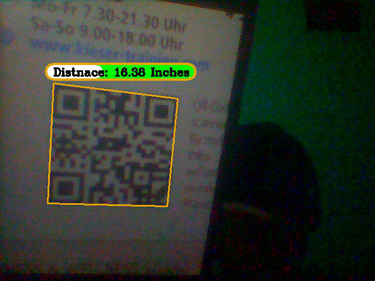

# QR detection and Distance Estimation using Single:one: camera :camera: opencv python :eye::eye:

QR code Detection and Distance Estimation opencv Python, it more accurate version of distance Estimation, [face detection and distnace Estimation](https://github.com/Asadullah-Dal17/Distance_measurement_using_single_camera), and it is open source project, feel free to contribute.

## Real time Distance Estimation

## Installation
Requirements: 
- Python 3.6.(Pyzbar works on fine Python 3.6.2) 
- [pyzbar](https://pypi.org/project/pyzbar/)
- opencv
- numpy 

#### Windows

- installation of pyzbar is not required on windows caused it shiped with python 3.6 wheel files.
  
- python packages 
  
    ` pip install opencv-python pyzbar numpy `

- Run the code

    `python main.py`
#### Linux 

**(I have't tried yet on linux)** if you do, please let me known.

- Install PyZbar

    `sudo apt-get install libzbar0`  
- Install python packages
  
  `pip3 install opencv-python numpy pyzbar`

- Run
  
    `python3 main.py`
#### Mac

**(I have't tried yet on Mac)** if you do, please let me known.

- Install PyZbar
  
  `brew install zbar`

- Install python packages
  
  `pip3 install opencv-python numpy pyzbar`

- Run
  
    `python3 main.py`
---
### TO DO
<!-- markdownlint-capture -->
<!-- markdownlint-enable-file MD000 -->

- [x]  QR code detection :bulb:

- [x] Euclidean distance (to find the **width of QR code**, more *accurately*) :bulb:
  
- [x] Find Distance between camera:eye: and QR code :bulb:

- [x] Distance is calculated and Displayed on Screen :bulb: 
  
- [x] Improve the Visual representation :green_heart:
- [ ] QR code Following Robot/Drone [Example](https://github.com/Asadullah-Dal17/Face-Following-Robot-using-Distance-Estimation)

----

I have create complete video on Youtube about [Distance Estimation uisng  single camera opencv python](https://www.youtube.com/watch?v=zzJfAw3ASzY), which explains how things works

---
if you have any Query feel free to ask me on my Social Media.

## :green_heart: Join Me on Social Media :green_heart:

